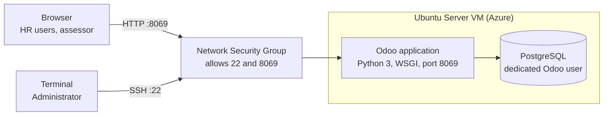

# Deploying an Odoo HR ERP on Microsoft Azure: Implementation, Challenges and Reflection

**DI Team** | Department of ICT | Southern Delta University, Ozoro | September 2026

---

## Abstract

This article documents how our team deployed Odoo, an open-source enterprise resource planning (ERP) platform, as a Human Resources management system on a Microsoft Azure virtual machine. We describe the infrastructure we provisioned, the network rules we configured, the software stack we installed, and how we opened the system to an external assessor. We also report the two technical problems that cost us the most time, an SSH connection timeout and Python dependency errors, and explain how each was resolved. The article closes with a reflection on how hands-on cloud deployment builds work-ready skills and global competitiveness for ICT graduates.

**Keywords:** Odoo, ERP, human resources, Microsoft Azure, cloud deployment, Ubuntu Server, PostgreSQL

---

## 1. Introduction

Human resources departments handle some of an organisation's most sensitive and time-critical records: employee profiles, leave balances, attendance, recruitment pipelines and payroll. When these live in separate spreadsheets and paper files, errors multiply and reporting becomes slow. An ERP consolidates them into one system with a single source of truth.

Historically, running an ERP meant buying servers and maintaining them on site. Cloud infrastructure has changed that. A virtual machine can be created in minutes, reached from anywhere, and paid for by usage. For students in a developing-economy setting, this lowers the barrier to working with enterprise-grade software that would otherwise be out of reach.

This project set out to do three things:

- Host a working Odoo HR ERP on Microsoft Azure so it is reachable through a live URL.
- Record the deployment process and the problems met along the way, so others can repeat it.
- Reflect on what the exercise taught us about being work-ready in a global job market.

## 2. Background

### Why Odoo

Odoo is a modular, open-source business suite. Its HR-related apps cover the functions described above: employee records, time off, attendance, recruitment and payroll. Because it is open source and runs on a standard Linux and PostgreSQL stack, it can be installed and studied without licence fees for the community edition, which makes it well suited to a teaching environment.

### Why Microsoft Azure

Azure offers infrastructure-as-a-service virtual machines with full control over the operating system and network. That control matters for learning. Rather than clicking through a managed installer, we had to make the decisions ourselves: which operating system, which ports to open, how to configure the database. Each of those decisions is a skill employers ask about.

## 3. Deployment guide

We deployed Odoo on an Ubuntu Server virtual machine hosted on Microsoft Azure. The overall arrangement is shown in Figure 1. Administrators reach the server over SSH on port 22, and users reach the Odoo web interface on port 8069. Both pass through the Azure Network Security Group (NSG), which decides what traffic is allowed in.

*Figure 1. Deployment architecture. All traffic enters through the NSG; the database sits behind the application on the same virtual machine.*

The steps we followed, in order:

1. **Provision the virtual machine.** We created an Ubuntu Server VM in the Azure portal to act as the host.
2. **Configure the Network Security Group.** We added inbound rules for TCP port 22 (SSH) and TCP port 8069 (Odoo web access).
3. **Connect over SSH.** From a local terminal we logged in to the headless server through Secure Shell.
4. **Prepare the system.** We updated the APT package manager, then installed the foundational dependencies: the Python 3 runtime libraries and Node.js.
5. **Set up PostgreSQL.** We installed PostgreSQL as the database engine, created a dedicated database user for Odoo, and prepared the schemas so data is stored reliably with ACID guarantees.
6. **Install and launch Odoo.** We installed the Odoo application packages, configured the WSGI web server gateway, and started the service, which brought up the Odoo dashboard.

**Table 1. Technology stack used in the deployment**

| Layer | Technology | Role |
|---|---|---|
| Cloud provider | Microsoft Azure | Hosts the virtual machine and enforces network rules through the NSG |
| Operating system | Ubuntu Server | Linux host managed through the command line |
| Runtime | Python 3, Node.js | Required by Odoo and its web assets |
| Database | PostgreSQL | Stores all ERP data with ACID compliance |
| Application | Odoo (HR apps) | Employee, leave, attendance, recruitment and payroll workflows |
| Remote access | SSH (port 22) | Secure administration of the server |

## 4. Giving the assessor access

A deployment is only useful for evaluation if the reviewer can see it working. We prepared the system for hand-over as follows:

- **A dedicated assessor account.** Instead of sharing the administrator login, we created a separate user with access to the HR apps. This keeps administrator credentials private and limits what a reviewer can change.
- **Sample data.** Records for employees, leave and similar workflows were needed so the reviewer sees a system in use rather than an empty shell.
- **A public repository.** Our configuration and setup instructions are kept in a GitHub repository with passwords and keys removed.
- **A recorded walkthrough.** A short screen recording shows the main HR workflows and where the system is hosted.
- **Uptime.** The virtual machine has to stay running throughout the assessment period, since a stopped or expired instance makes the live URL unreachable.

## 5. Challenges

Two problems slowed us down. Both are common for first-time cloud deployments, which is why we record them here.

### Challenge 1: SSH connection timeout on Azure

- **What happened:** During initial setup, our terminal repeatedly timed out when trying to connect to the virtual machine.
- **Cause:** The Network Security Group had no inbound rule permitting SSH traffic, so Azure silently dropped our connection attempts.
- **Resolution:** We returned to the Azure dashboard and edited the NSG rules, adding an inbound rule that allows TCP traffic on port 22 from our own local IP address. The connection succeeded immediately afterwards. Restricting the rule to a single source address also meant we did not expose SSH to the whole internet.

### Challenge 2: Python package errors during installation

- **What happened:** While preparing the application environment, the system reported multiple errors saying that certain Python packages were missing or incompatible.
- **Cause:** The Ubuntu package lists were out of date, and the libraries Odoo expects had not been installed.
- **Resolution:** We refreshed the repositories with `sudo apt-get update` and `upgrade`, then installed, one by one, the exact Python 3 runtime libraries named in the Odoo documentation. After that we restarted the deployment script and it completed.

## 6. Discussion

### What the challenges taught us

Both problems came from the layer beneath the application. The first was a networking rule and the second was package hygiene, and neither had anything to do with Odoo itself. The lesson is to check the environment before suspecting the software: confirm the network path is open, and confirm the system is up to date, before debugging the application.

### Security considerations

Opening only the ports that are needed, and limiting SSH to a known IP address, applies the principle of least privilege at the network level. Using a separate assessor account applies the same principle at the application level.

### Recommended next steps

The following are improvements we would make for a production system rather than a course deployment:

- Serve Odoo over HTTPS by placing a reverse proxy in front of it, rather than exposing port 8069 directly.
- Schedule regular database backups and test that they restore.
- Set up monitoring and a budget alert, so cost and downtime do not go unnoticed.

## 7. Reflection: work-readiness and global competitiveness

The question we set ourselves was how cloud deployment makes us more work-ready and globally competitive.

Deploying an enterprise application directly to cloud infrastructure closes the gap between theory and practice. By working in Microsoft Azure, configuring a virtual machine and managing a Linux server from the command line, we gained technical skills that employers actively look for. The project required us to design a working solution, troubleshoot real networking and dependency failures, and manage a remote system securely.

> Cloud computing removes geographical barriers, so the skills learned here apply to businesses anywhere in the world.

Understanding how to host and maintain an ERP means we can contribute to organisations regardless of location. That is what moves a student from completing exercises to being a professional who can support digital transformation.

## 8. Conclusion

We deployed an Odoo HR ERP on an Ubuntu Server virtual machine in Microsoft Azure, backed by PostgreSQL and reachable through a public URL, with a dedicated account for the assessor. Two obstacles, an SSH timeout caused by a missing NSG rule and Python dependency errors caused by stale repositories, were resolved by working through the environment layer by layer. The exercise gave us practical experience in cloud provisioning, Linux administration, database setup and secure remote access, skills that transfer directly to professional ICT work.

---

*DI Team, Department of ICT, Southern Delta University, Ozoro.*
